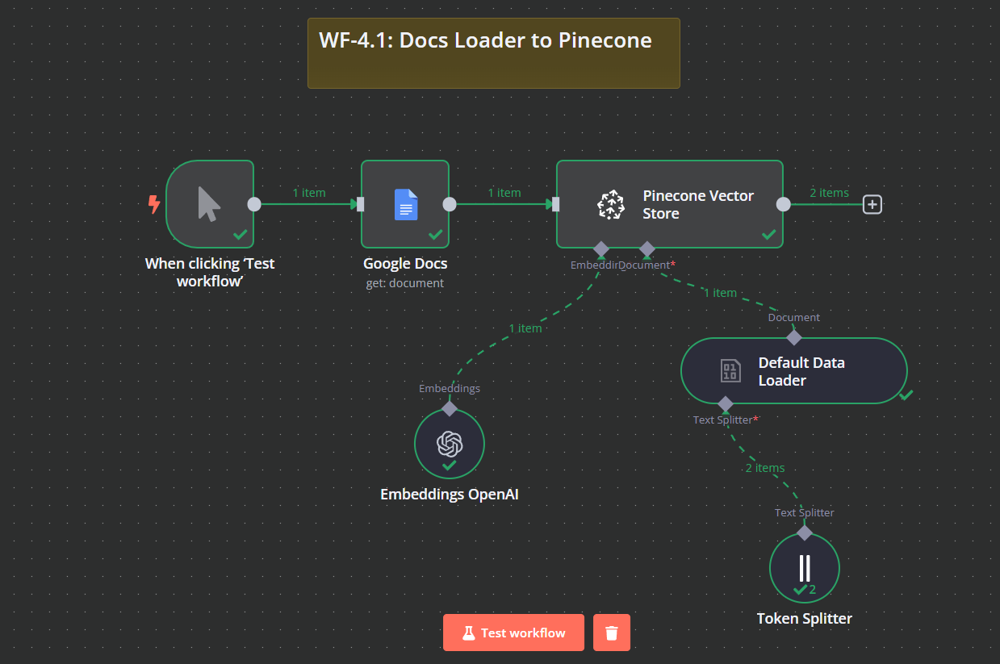
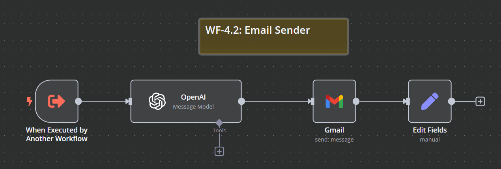
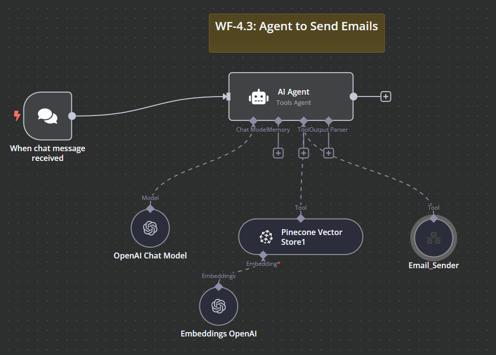

# WF-4.1, WF-4.2 & WF-4.3: Document Processing & Email Automation Workflows

## 📌 Overview
This **n8n workflow** consists of three interconnected parts:
- **`WF-4.1: Docs Loader to Pinecone`** – Loads structured document data into a **vector database**.
- **`WF-4.2: Email Sender`** – Sends emails with dynamic content.
- **`WF-4.3: Agent to Send Emails`** – Uses an AI agent to retrieve contact information and send emails automatically.

The workflows leverage OpenAI for text embeddings, Pinecone for vector storage, Gmail for email automation, and n8n for workflow orchestration.

## 🔧 Workflow Components
### 🏗️ WF-4.1: Docs Loader to Pinecone
1. **📂 Google Docs** – Fetches source documents for processing.
2. **🧠 OpenAI Embeddings** – Converts text data into vector embeddings.
3. **📌 Pinecone Vector Store** – Stores embeddings for retrieval.
4. **📝 Token Splitter** – Splits large text documents for efficient embedding.

### 🏗️ WF-4.2: Email Sender
1. **📨 Chat Trigger** – Receives email-sending requests.
2. **🤖 OpenAI Parser** – Extracts email parameters from the request.
3. **📧 Gmail API** – Sends emails using parsed details.
4. **📊 Field Editor** – Updates workflow output with email status.

### 🏗️ WF-4.3: Agent to Send Emails
1. **💬 Chat Trigger** – Listens for user queries.
2. **🤖 AI Agent** – Determines required actions (response, contact retrieval, email sending).
3. **📚 Vector Store Lookup** – Searches Pinecone for stored contacts.
4. **📤 Email Sender Integration** – Calls the Email Sender workflow when needed.

## ⚙️ How It Works
### 🔹 Document Processing (WF-4.1)
1. 📄 A document is retrieved from **Google Docs**.
2. 📊 The **Token Splitter** processes and prepares data for embedding.
3. 🤖 The **OpenAI Embeddings** node converts text into vector format.
4. 📥 Data is stored in **Pinecone Vector Store**.

### 🔹 Email Sending (WF-4.2)
1. ❓ A request is received for sending an email.
2. 🔍 The **OpenAI Parser** extracts required parameters.
3. 📤 The **Gmail API** sends the email.
4. ✅ The system updates the status.

### 🔹 AI-Based Email Agent (WF-4.3)
1. 💬 A chat message is received.
2. 🔎 The AI determines if it’s a general query, contact retrieval, or email request.
3. 📚 Pinecone is queried for contact details if needed.
4. 📤 The Email Sender workflow is triggered when required.

## 📷 Workflow Screenshots
### WF-4.1: Docs Loader Workflow

### WF-4.2: Email Sender Workflow

### WF-4.3: AI Agent Workflow

## 🚀 Setup Instructions
- 📥 **Import the workflows** into `n8n`.
- 🔑 **Ensure API credentials** for OpenAI, Google Docs, Gmail, and Pinecone are set up.
- ✅ **Activate the workflows** to start document processing and email automation.

## 📝 Notes
- ⚠️ The workflows are **inactive by default**.
- 🛠️ Modify the Pinecone namespace and data sources as needed.
